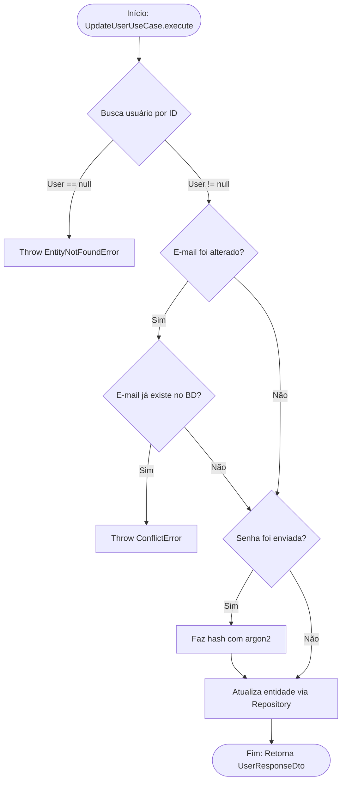

# Mermaid Flow

## Objetivo
Sempre que você criar ou realizar modificações na lógica de um Use Case, você **deve** gerar (ou atualizar) um arquivo Markdown contendo o diagrama de fluxo exato daquele caso de uso. O arquivo deve se chamar `[nome_do_use_case].mermaid.md` e **deve ser salvo obrigatoriamente dentro da pasta `docs/flow/`** na raiz do projeto.

## Diretrizes de Geração
1. **Padrão de Documentação**: O arquivo final deve obedecer às formatações e tags de metadados estipuladas pela skill `documentation-standard`.
2. **Nível de Detalhe Extremo**: O diagrama de fluxo (`flowchart TD` do Mermaid) deve conter **todos** os passos da função.
   - Ponto de entrada (parâmetros/DTOs).
   - Todas as decisões lógicas (`if`, `else`, `switch`).
   - Todos os cenários de erro ou exceções (`throw new Error`, validações que falham).
   - Chamadas externas ou idas ao banco de dados (Repository, Services).
   - O ponto de saída e o formato de retorno final.
3. **Atualização Contínua**: Assim como o código vivo, toda alteração de lógica do Use Case que for solicitada no chat deve vir acompanhada da atualização correspondente no arquivo `.mermaid.md`.
4. **Formato**: Utilize o formato `flowchart TD` para desenhar fluxos de decisão. Utilize formatos em losango `{ }` para os `if`s e setas duplas ou caminhos explícitos (`-- Yes -->`, `-- No -->`) para ramificações.

## Exemplo de Diagrama de Uso
```markdown
# Fluxo: Update User Use Case
[Metadados definidos pela documentation-standard...]


```
