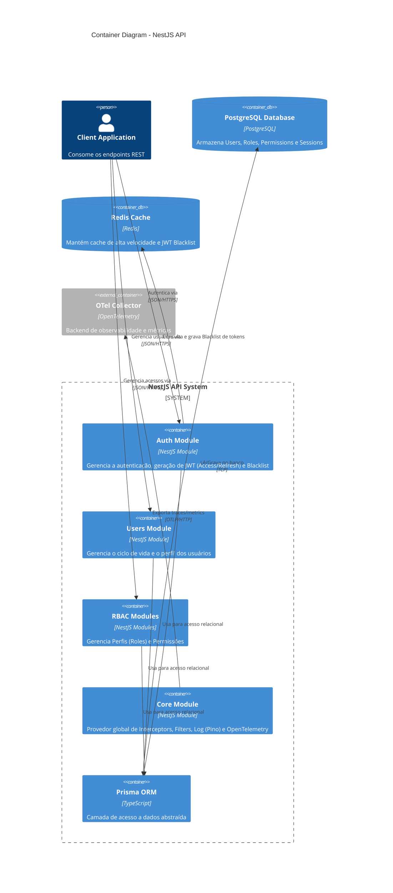

<!-- ai:doc id="c4.containers" category="architecture" kind="documentation" status="active" -->
<!-- ai:tags c4 containers architecture -->
<!-- ai:audience developers architects -->

# Container Diagram

Este diagrama (Nível 2) expande as fronteiras internas da API NestJS, detalhando os módulos principais de negócio e infraestrutura.

