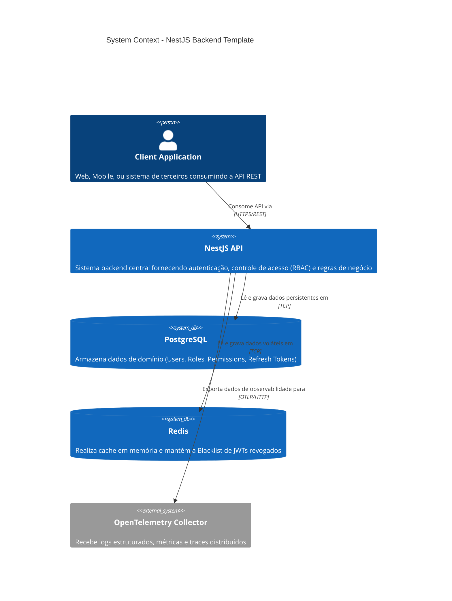

<!-- ai:doc id="c4.context" category="architecture" kind="documentation" status="active" -->
<!-- ai:tags c4 context architecture -->
<!-- ai:audience everyone -->

# System Context Diagram

Este diagrama (Nível 1) exibe o sistema da API NestJS em seu ambiente, destacando os sistemas e atores externos fundamentais com os quais interage.

