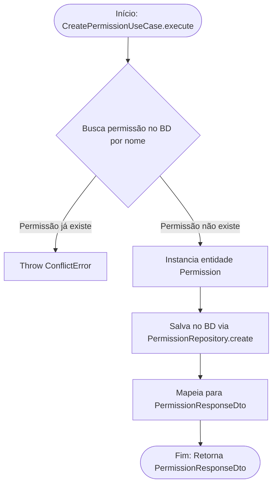

<!-- ai:doc id="docs.flow.create-permission-use-case" category="flow" kind="documentation" status="active" -->
<!-- ai:tags flow mermaid use-case permissions create -->
<!-- ai:audience developers ai-agents -->

# Fluxo: Create Permission Use Case

Este arquivo documenta o fluxo executado durante a criação de uma permissão (Permission).

