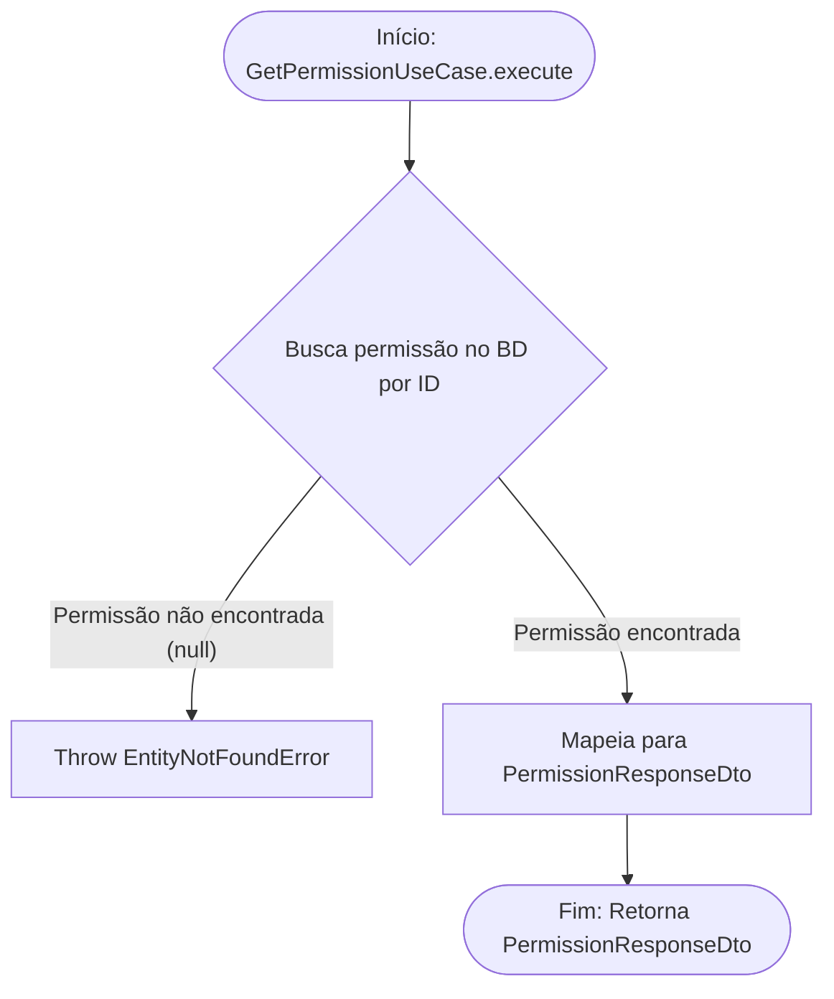

<!-- ai:doc id="docs.flow.get-permission-use-case" category="flow" kind="documentation" status="active" -->
<!-- ai:tags flow mermaid use-case permissions get -->
<!-- ai:audience developers ai-agents -->

# Fluxo: Get Permission Use Case

Este arquivo documenta o fluxo executado durante a busca de uma única permissão (Permission) pelo ID.

