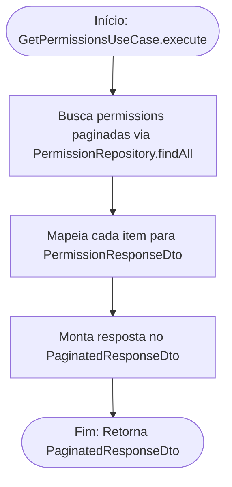

<!-- ai:doc id="docs.flow.get-permissions-use-case" category="flow" kind="documentation" status="active" -->
<!-- ai:tags flow mermaid use-case permissions list -->
<!-- ai:audience developers ai-agents -->

# Fluxo: Get Permissions Use Case

Este arquivo documenta o fluxo executado durante a listagem paginada de permissões (Permissions).

