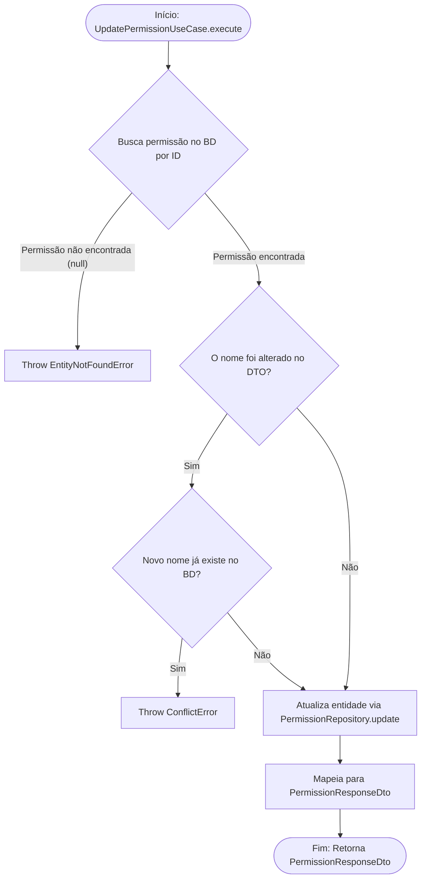

<!-- ai:doc id="docs.flow.update-permission-use-case" category="flow" kind="documentation" status="active" -->
<!-- ai:tags flow mermaid use-case permissions update -->
<!-- ai:audience developers ai-agents -->

# Fluxo: Update Permission Use Case

Este arquivo documenta o fluxo executado durante a atualização de uma permissão (Permission).

