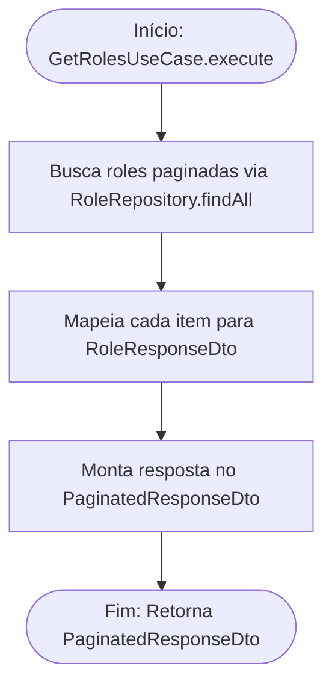

<!-- ai:doc id="docs.flow.get-roles-use-case" category="flow" kind="documentation" status="active" -->
<!-- ai:tags flow mermaid use-case roles list -->
<!-- ai:audience developers ai-agents -->

# Fluxo: Get Roles Use Case

Este arquivo documenta o fluxo executado durante a listagem paginada de perfis (Roles).

