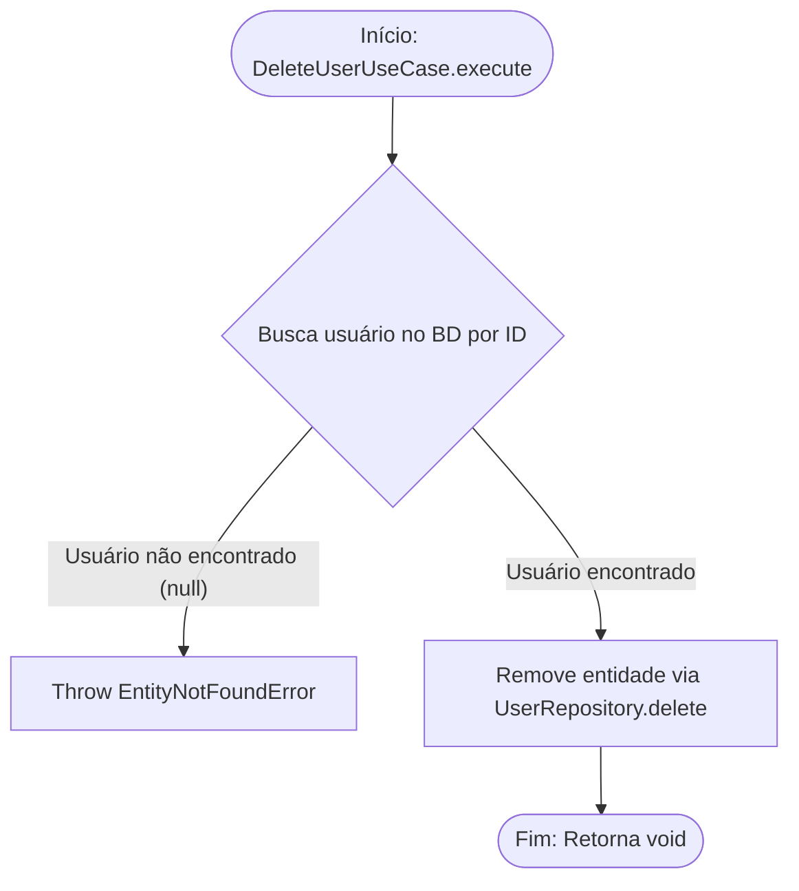

<!-- ai:doc id="docs.flow.delete-user-use-case" category="flow" kind="documentation" status="active" -->
<!-- ai:tags flow mermaid use-case users delete -->
<!-- ai:audience developers ai-agents -->

# Fluxo: Delete User Use Case

Este arquivo documenta o fluxo executado durante a remoção de um usuário (User).

