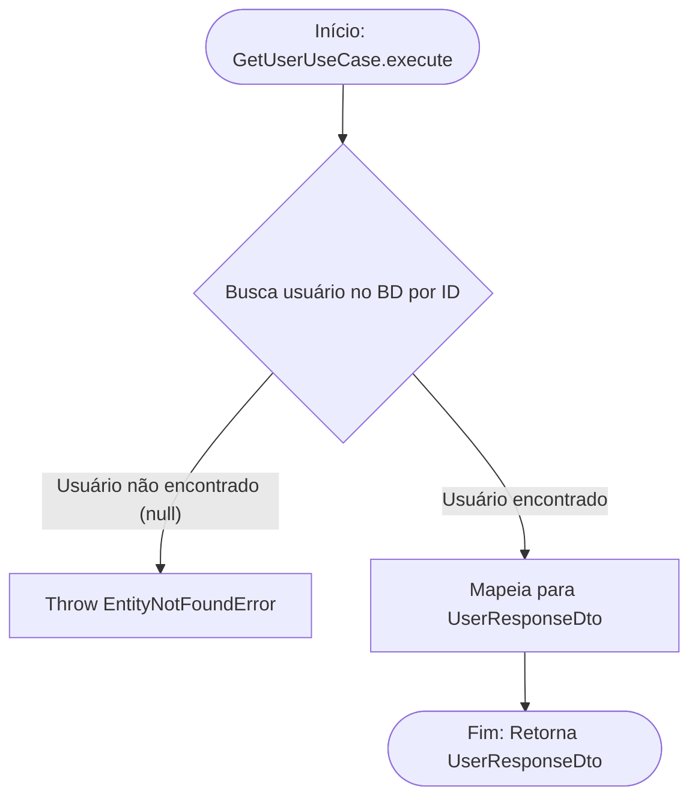

<!-- ai:doc id="docs.flow.get-user-use-case" category="flow" kind="documentation" status="active" -->
<!-- ai:tags flow mermaid use-case users get -->
<!-- ai:audience developers ai-agents -->

# Fluxo: Get User Use Case

Este arquivo documenta o fluxo executado durante a busca de um único usuário (User) pelo ID.

