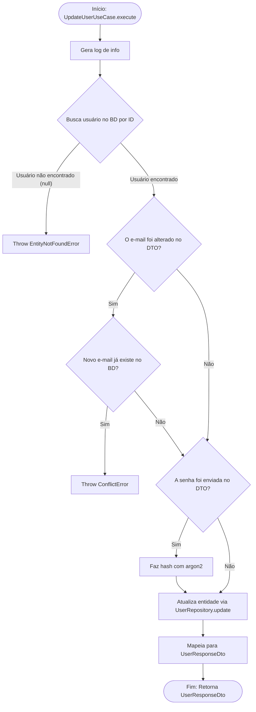

<!-- ai:doc id="docs.flow.update-user-use-case" category="flow" kind="documentation" status="active" -->
<!-- ai:tags flow mermaid use-case users update -->
<!-- ai:audience developers ai-agents -->

# Fluxo: Update User Use Case

Este arquivo documenta o fluxo executado durante a atualização de um usuário (User).

